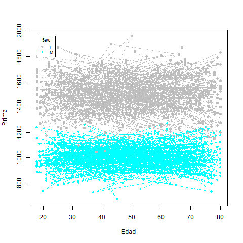

# Primas

##Análisis Univariado


##Análisis Bivariado

### Edad y Sexo vs Prima

```R
xrange<-range(primas$Prima)
xrange<-range(primas$Edad)
yrange<-range(primas$Prima)
plot(xrange, yrange, type="n", xlab="Edad", ylab="Prima" ) 

#colors <- rainbow(2)
#linetype <- c(1:2)
plotchar <- seq(18,18+2,1)
M <- subset(primas, Sexo=="M")
F <- subset(primas, Sexo=="F")

lines(M$Edad, M$Prima, type="b", lwd=1.5,
    lty=5, col=5, pch=plotchar[1])


lines(F$Edad, F$Prima, type="b", lwd=1.5,
    lty=8, col=8, pch=plotchar[2])

legend(xrange[1], yrange[2], c("F","M"), cex=.7, col=c(8,5),
  	pch=c(19,18), lty=c(8,5), title="Sexo")
```
 

La anterior gráfica muestra una clara diferencia entre la prima cobrada a mujeres y la cobrada a hombres, donde estos últimos tienen que pagar menos por el seguro de su auto. 

En cambio la edad pareciera ser una variable poco importante al momento de calcular las primas, pues bien puede haber mujeres jóvenes que gastan lo mismo en su seguro de auto que algunas mujeres adultas; lo mismo se percibe en los hombres.

##Árbol de decisión


```R
library(rpart)
library(rpart.plot)

primas2<-primas

primas2$Fecha<-as.Date(primas2$Fecha,"%d/%m/%Y")
clases <- cut(primas2$Fecha, "year", labels=c(2014,2015,2016,2017))
primas2$Fecha <- as.factor(clases)

ModeloArbol<-rpart(Prima  ~ .,data=primas2,parms=list(split="information"))

 
# PASO 4: Crea Grafico
rpart.plot(ModeloArbol, type=1, extra=100,cex = .7, box.col=c("gray99", "gray88")[ModeloArbol$frame$yval])
```
 
