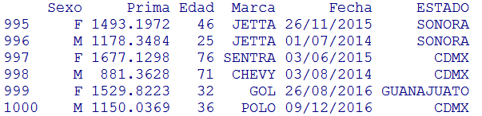
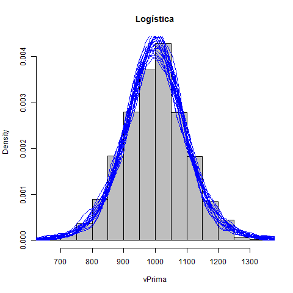

#Tabla de contenidos
1.- [ejemplo] (#fecha)
# Primas

Para poder trabajar con el archivo *primas.csv* en *R* y darle un primer vistazo a la tabla de datos ejecutaremos el siguiente código:
```R
#Guarda la tabla en "primas"
primas<-read.csv("primas.csv")

#Muestra las últimas observaciones de la tabla
tail(primas)
```


Nuestra tabla de datos se compone de 1000 observaciones y seis variables: *Sexo*, *Prima*, *Edad*, *Marca*, *Fecha*, *Estado*.


##Análisis Univariado: Conociendo nuestra cartera

### Sexo
```R
#Barras de frequencia en la variable "Sexo"
barplot(table(primas$Sexo), main="Sexo", col=8)
```


### Edad
Para resumir la variable *Edad* implementaremos el siguiente código:
```R
edad<-primas$Edad

#Resumen de la variable "Edad"
summary(edad)
```


Los resultados anteriores nos señalan que el rango de edad de los clientes es entre 18 y 80 años; en promedio tienen entre 48 y 49 años.

La desviación estándar está dada por la función `sd()`:
```R
#Desviación Estándar
sd(edad)
```


```R
#Prueba de Kolmogórov-Smirnov, estimadores por máxima verosimilitud
ks.test(edad,y="punif",min(edad),max(edad))
```


Dado que el *p-value* es 0.1611, mayor que un nivel de significación 0.05 o 0.10 no podemos rechazar la hipótesis de que la muestra *Edades* se distribuye como una Uniforme(a,b) con a=min(edad)=18 y b=max(edad)=80.

Distribución empirírica de la variable *Edades* comparada con 50 simulaciones de una distribución Unif(18,80): 
```R
hist(edad, prob=TRUE,main="Edad",col=8)

for(i in 1:50)
lines(density(runif(1000,min(edad),max(edad))),col="blue")
```


### Marca de auto
Cada marca de auto que aparece en esta tabla y su respectiva frecuencia la podemos obtener con la función `table()`:
```R
table(primas$Marca)
```


```R
nrow(table(primas$Marca))
```


Contamos con 8 marcas diferentes, la mayoría de los autos son Jetta y la marca con menos presencia es March.

Graficamente podemos ver los resultados anteriores con la función `barplot()`:
```R
#Barras de frequencia en la variable "Marca"
barplot(table(primas$Marca), main="Marca", col=8)
```


### Fecha
Para la variable *Fecha* veremos las frecuencias por año:
```R
Año<-as.Date(primas$Fecha,"%d/%m/%Y")
clases<-cut(Año, "year", labels=c(2014,2015,2016,2017))
Año<-as.factor(clases)
table(Año)
```


```R
barplot(table(Año))
```


### Estado
```R
#Barras de frequencia en la variable "Estado"
barplot(table(primas$ESTADO), main="Estado", col=8)
```


##Análisis Multivariado

### Edad y Sexo vs Prima

```R
xrange<-range(primas$Edad)
yrange<-range(primas$Prima)
plot(xrange, yrange, type="n", xlab="Edad", ylab="Prima" ) 

M <- subset(primas, Sexo=="M")
F <- subset(primas, Sexo=="F")

points(F$Edad, F$Prima, lty=8, col=8, pch=19)

points(M$Edad, M$Prima, lty=5, col=5, pch=18)

legend(xrange[1], yrange[2], c("F","M"),cex=.7, col=c(8,5), pch=c(19,18), lty=c(8,5), title="Sexo")
```
 

La anterior gráfica muestra una clara diferencia entre la prima cobrada a mujeres y la cobrada a hombres, donde estos últimos tienen que pagar menos por el seguro de su auto. 

En cambio la edad pareciera ser una variable poco importante al momento de calcular las primas, pues bien puede haber mujeres jóvenes que gastan lo mismo en su seguro de auto que algunas mujeres adultas; lo mismo se percibe en los hombres.


###Árbol de decisión

```R
library(rpart)
library(rpart.plot)

primas2<-primas

primas2$Fecha<-as.Date(primas2$Fecha,"%d/%m/%Y")
clases <- cut(primas2$Fecha, "year", labels=c(2014,2015,2016,2017))
primas2$Fecha <- as.factor(clases)

Arbol<-rpart(Prima  ~ .,data=primas2,parms=list(split="information"))

rpart.plot(Arbol, type=1, extra=100)
```


El árbol de decisión, en una primera instancia, sólo segmenta una vez: en hombre y mujer.

La raíz del árbol contiene el 100% de la población e indica que en promedio los clientes pagan $1250 por su seguro de auto.

Al segmentar obtenemos dos nodos, cada uno con el 50% de la población:
* **Nodo 1:** Hombres, en promedio pagan una prima de $1000.
* **Nodo 2:** Mujeres, en promedio pagan una prima de $1500.

De nuevo concluimos que las primas son más elevadas para las mujeres, estas son en promedio 50% más caras que las de los hombres.


###Coeficientes Principales
Análisis de coeficientes principales en *SAS Enterprise Miner*:


La primer componente principal divide en dos grupos a los clientes y básicamente se basa en la variable *Sexo*.


El resultado de este análisis nos muestra 4 componentes principales que apenas alcanzan a explicar el 39.16% de la varianza, para explicar al menos el 75% de la varianza necesitaríamos 9 componentes principales, que son más que la cantidad de variables iniciales. 

##Distribución de la variable *Prima*

Con los resultados anteriores nos hemos dado cuenta que la variable *Sexo* influye bastante al momento de calcular una prima, pues en promedio las mujeres pagan más: ¿será que se modela diferente o ambos sexo seguirán la misma distibución salvo un recargo?

Para responder la anterior pregunta analizaremos qué ocurre con la variable *Prima* dado que el cliente es hombre (*Sexo=="M"*) y, por otro lado, dado que es mujer (*Sexo=="F"*):

```R
summary(primas[primas$Sexo=="M","Prima"])
``` 
Min.  | 1st Qu.| Median |  Mean | 3rd Qu. |  Max. 
------|--------|--------|--------|--------|-------
672.2 | 935.2  | 1004.0 | 1000.0 | 1067.0 | 1275.0 


```R
summary(primas[primas$Sexo=="F","Prima"])
```
Min. | 1st Qu.| Median | Mean | 3rd Qu.| Max. 
-----|--------|--------|------|--------|-------
1045 | 1398   | 1504   | 1500 | 1595   | 1958 


Si analizamos la proporción de las medidas de tendencia de las primas de mujeres y hombres nos daremos cuenta, una vez más, que las mujeres pagan aproximadamente 50% más que los hombres.

```R
summary(primas[primas$Sexo=="F","Prima"])/summary(primas[primas$Sexo=="M","Prima"])
```
  Min.  | 1st Qu.| Median | Mean   | 3rd Qu.|   Max.
--------|--------|--------|--------|--------|-------
1.554597|1.494867|1.498008|1.500000|1.494845|1.535686 


Lo mismo ocurre con las distribuciones que se ajustan a los datos. Gracias a la librería `rriskDistributions` y su función `fit.cont()`, podemos encontrar que la variable *Prima* tanto en hombres como en mujeres se ajusta, entre otras, a una distribución Normal o a una distribución Logistica basándonos en la prueba de *Kolmogórov-Smirnov*:

```R
library(rriskDistributions)

#Ajustar distribución en variable "Prima"

#Condición: Sexo=="M" (Hombres)
ajuste<-fit.cont(primas[primas$Sexo=="M","Prima"])

#Condición: Sexo=="F" (Mujeres)
ajuste<-fit.cont(primas[primas$Sexo=="F","Prima"])
```


Dist.   | Hombres |        | Mujeres  |        |
--------|---------|--------|----------|---------
        |Mean     | SD     | Mean     | SD
Normal  |1000     |99.89995|1500      |149.8499 
        |location |  scale |location  |scale
Logistic|1000.7258|56.9268 |1500.69773|85.52088

Con esto comprobamos que dada una distribución *X* que describe la prima cobrada a los hombres para su seguro de autos, la variable que determina lo mismo para las mujeres es *(1.5)X*. Por lo tanto supondremos que, en un principio, la variable *Prima* se modela de igual forma para hombres que para mujeres pero al final ***a las mujeres se les cobra un recargo del 50%*** de la prima calculada.

Dicho esto, con el fin de buscar más variables significativas al momento de calcular la prima, modificaremos un poco la tabla de datos aplicando la misma transformación de la variable *Fecha* que el aplicado anteriormente en el Árbol de decisión, cambiando el valor de la prima de cada mujer por ese mismo valor sobre 1.5 y, finalmente, eliminando la variable *Sexo*:

```R
primas2<-primas

#Cambiar el formato de Fecha de dd/mm/yyyy a sólo yyyy
primas2$Fecha<-as.Date(primas2$Fecha,"%d/%m/%Y")
clases <- cut(primas2$Fecha, "year", labels=c(2014,2015,2016,2017))
primas2$Fecha <- as.factor(clases)

#Prima de mujeres = prima de mujeres / 1.5
primas2[primas2$Sexo=="F",]$Prima<-primas2[primas2$Sexo=="F",]$Prima/1.5

#Eliminar la variable "Sexo"
primas2<-primas2[,2:6]

#Así es como se ve nuestra tabla ahora:
head(primas2)
```


```R
library(rriskDistributions)
vPrima<-primas2[,"Prima"]

#Ajustar distribución en variable "Prima"

#Esta vez no hay alguna condición extra
ajuste<-fit.cont(vPrima)
```


Par.\Dist.| Normal | Logistica
----------|--------|--------
     a    |  1000  |1000.5809
     b    |99.89995|56.9967
       

Distribución empirírica de la variable *Prima* comparada con 20 simulaciones de una distribución Logistica(1000.5809,56.9967):

```R
hist(vPrima, prob=TRUE,main="Logística",col=8)

for(i in 1:20)
lines(density(rlogis(1000,1000.5809,56.9967)),col="blue")
```


Distribución empirírica de la variable *Prima* comparada con 20 simulaciones de una distribución Normal(mean(vPrima),sd(vPrima)):

```R
hist(vPrima, prob=TRUE,main="Normal",col=8)

for(i in 1:20)
lines(density(rnorm(1000,mean(vPrima),sd(vPrima))),col="blue")
```


